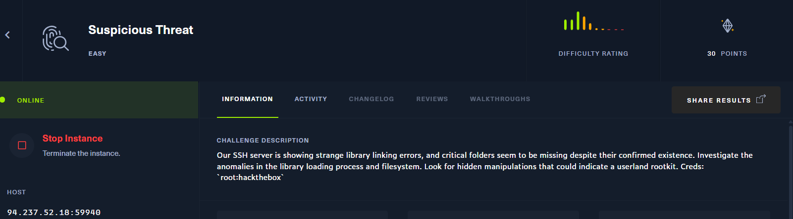
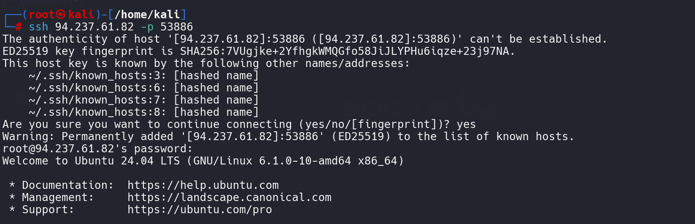
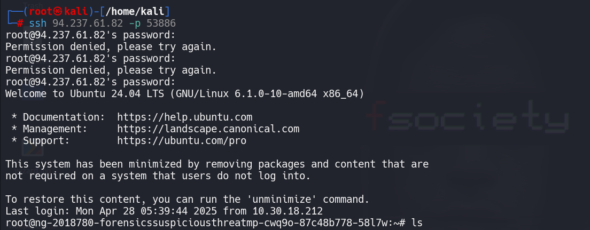
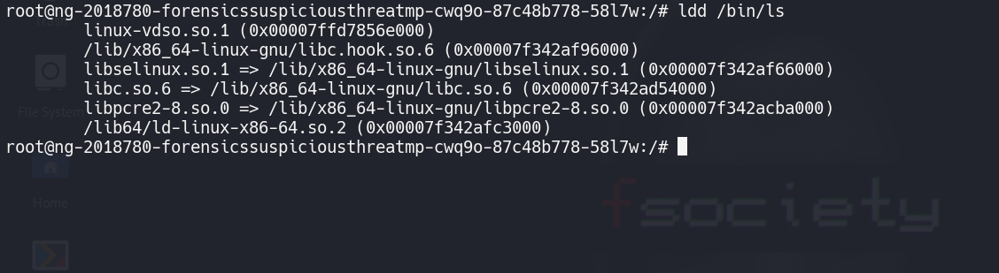
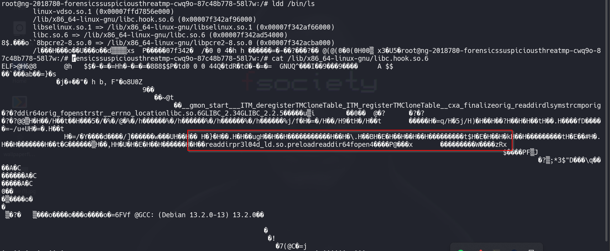
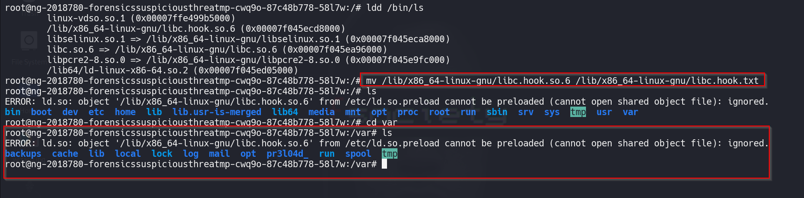
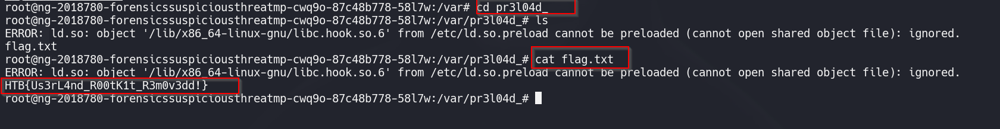

### Initial Access via SSH
We begin the challenge by establishing an SSH connection to the target server.

### Suspicious Behavior in the File System
Upon successful login, we are placed in the root directory. However, executing the ls command in the root or any other directory returns no output, which is highly unusual and indicates that something may be deliberately hidden.

### Investigating Rootkit Activity
As the challenge description suggests that a rootkit might be involved, likely manipulating shared libraries to hide files, we proceed to investigate further. Running ls continues to show no output:
To analyze the shared library dependencies used by common system utilities (like ls), we utilize the ldd command.

### Detection of a Malicious Shared Library
One suspicious library stands out. A closer examination indicates that it hooks filesystem-related functions such as readdir and fopen, a typical behavior of rootkits aiming to hide specific files or directories.
To neutralize this threat, we rename the library to prevent it from being loaded.

After renaming the malicious shared object (hook.so), the ls command begins functioning normally again, confirming that it was indeed being interfered with by the preload.
With the rootkit effectively bypassed, we are now able to list files and directories properly. After exploring the file system, we successfully locate the flag inside the /var directory.

### Locating the Flag

